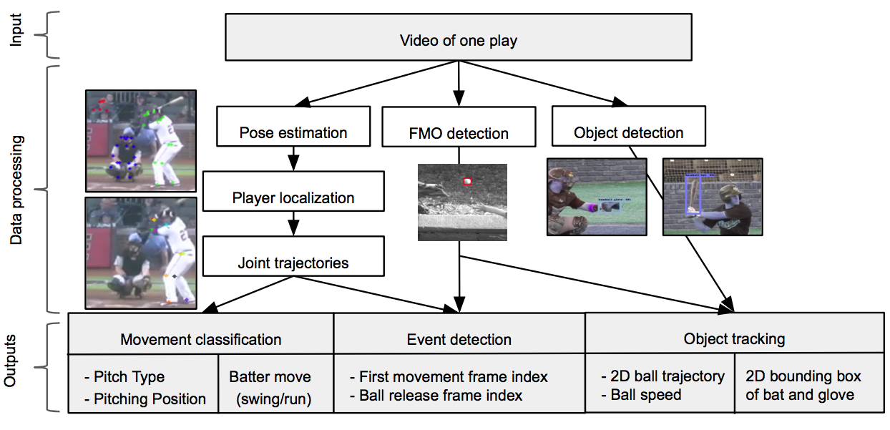

# Lego Tracker

Baseball analysis system


{#fig: data_processing}

## Dependencies:
To create a temporary environment in anaconda:

```bash
conda env create -f environment.yml
source activate baseball_analysis
```
Otherwise see requirements.txt file (can be installed in anaconda by 

```bash
conda install --yes --file requirements.txt
```
or
```bash
while read requirement; do conda install --yes requirement; done < requirements.txt
```

## For all parts of the paper, see the corresponding folder (Event detection, Pose estimation, etc.)


## 2. Testing
* Usage of ALL TEST FUNCTIONS is demonstrated in [this notebook](demo.ipynb)
* Event detection: Test functions for release frame, batter movement and pitcher's first move in [detect events](3_Event_Detection/detect_events.py)
* Movement classification: use [test file](test.py) with approriate model from [models](saved_models) and your input data
* Fast moving object detection: [this file](3_Event_Detection/fom_detection.py) contains a script and function taking a video as input, outputting pitcher's first movement frame index, release frame index and ball trajectory and speed, but the same can be found in the jupyter notebooks for ball and bat detection 
  * hyperparameters can be set in [config](config.py)
  * for usage type $ python fom_detection.py --help

## 3. Training
* Data can partly be found in [this folder](train_data), but large files need to be downloaded from Google Drive
 

# 4. Utils:
* Single files with helper functions can be found in [utils](utils)
* [Tools](tools.py) contains functions for calculating accuracy, extending data, balancing data - used in almost all train files
* [Preprocessing](data_preprocess.py) offers functions to read data from old csv files, from folders containing json files or new csv files
* [coord_fill_in](coord_fill_in_train.py)
  * Used LSTM to learn coordinate trajectories to fill in missing values, works but not plotted yet
  * ML coord fill in [RNN here](data_preprocessing/coord_fill_in.py)

