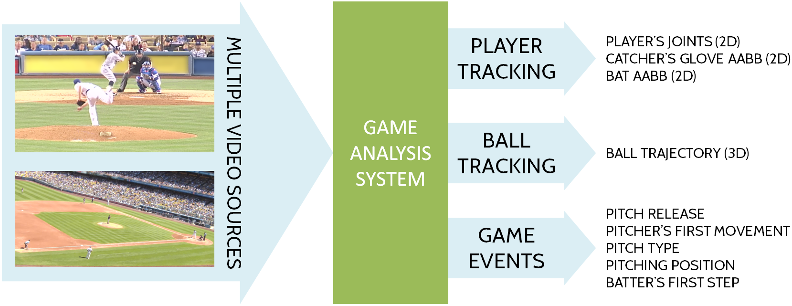
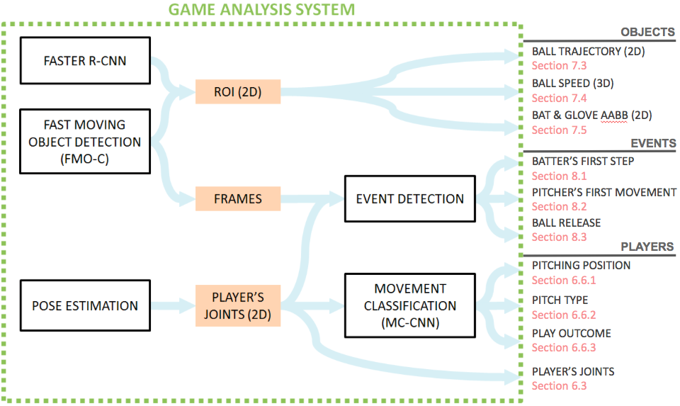

\pagebreak


{#fig: system_overview}


{#fig: game_analysis_system}

# Overview (Main directory)

The proposed framework consists of three main modules: player tracking, object tracking and event detection. Different methods are combined for each module. The code is also sorted into these three modules, where player tracking is further divided into pose estimation and movement classification.

Firstly I will explain the code that is used for multiple tasks (and is thus stored in the main directory). To run experiments for a specific section of the thesis though, refer to the corresponding section in this documentation.

## Dependencies
To create a temporary environment in anaconda:

```bash
conda env create -f environment.yml
```
Otherwise see requirements.txt file - can be installed in anaconda with 

```bash
conda install --yes --file requirements.txt
```
or
```bash
while read requirement; do conda install --yes requirement; done < requirements.txt
```

Then activate the environment (and deactivate when finished):

On OSX:

```bash
source activate baseball_analysis
source deactivate
```

On Windows:

```bash
activate baseball_analysis
deactivate
```

### Operating systems

The OpenCV version which is used here does not work on Windows properly. The videos can not be read in, probably due to an error related to ffmpeg. If this error occurs, you can use another OpenCV version: To update OpenCV, activate the environment and then type

```bash
conda install opencv 
```

However, in the updated OpenCV version, the videos are sometimes processed differently. Thus, the notebook *4_Object_tracking/ball_speed.ipynb* might not work correctly, and when plotting on videos, the video might lag behind.

On OS X, everything should work with OpenCV 3.1.0.

## Demo notebook

For a quick demonstration of each method for each task (movement classification and event detection), see the notebook [*demo.ipynb*](demo.ipynb). The outputs for example videos saved in the folder [*demo_data*](demo_data) are visualized in this notebook.

## Train data

All data required for training is contained in the [*train_data*](train_data) folder:

### Video data
* The major video database consists of center-field and side-view videos, one for each play (6 seconds length). The videos are sorted by data, and are stored in [*train_data/ATL*](train_data/ATL).
* For the batter's first step, a separate folder of videos was created that only contains videos (and the belonging joint trajectories) in which the batter starts to run. This folder is [*train_data/batter_runs/videos*](train_data/batter_runs/videos)
* For bat detection, high quality videos from YouTube are used. They are stored in [*train_data/high_quality_videos*](train_data/high_quality_videos).
* For ball speed I use shorter videos from a public database, that show only the ball trajectory (<1 second). There are two side-view and one center-field camera for each play (folders of 6-digit-play id). They are stored in [*train_data/short_ball_speed_videos*](train_data/short_ball_speed_videos).

### Pose estimation output
* Joint trajectories for pitcher and batter in center-field and side-view videos are saved as csv files, one for each view (cf for center-field, sv for side-view) and each player (pitcher and batter): *cf_pitcher.csv, cf_batter.csv, sv_pitcher.csv and sv_batter.csv*
* Joint trajectories for high quality videos can be found in the folder [*train_data/batter_hq_joints*](train_data/batter_hq_joints).

### Metadata
* For player localization, the start position of the target player must be provided. 
	* For ATL videos, *.dat* files with bounding boxes for each video are stored in the same folder as the videos.
	* For high quality videos, I manually created a file *center_dics.json* that is stored in the *train_data* folder as well.
* In order to estimate the ball release frame, the ball speed is estimated as well. To compare it to ground truth speed from Statcast, these Statcast values are saved in a separate json file (containing the speed for each side-view video): [*train_data/speed_labels_sv.json*](train_data/speed_labels_sv.json)
* Manually labeled (with gradient approach) data for the batters first step: [*train_data/batter_runs/labels_first_batter_test*](train_data/batter_runs /labels_first_batter_test) and 
[*train_data/batter_runs/labels_first_batter_train*](train_data/batter_runs/labels_first_batter_train).
* When a model is trained to find the batter's first step, the training data can be saved and visualized. An example is saved in [*train_data/batter_first_data*](train_data/batter_first_data) and [*train_data/batter_first_label*](train_data/batter_first_label)

## FMO-detection

Fast Moving Object (FMO) Detection finds moving objects by thresholding difference images and searching for connected components. Here, it is used to track objects and to find the pitcher's first movement. The algorithm is build on the work in "The World of Fast Moving Objects"[@Rozumnyi2017]. 

As FMO-detection is used for both object tracking and event detection, the script and relevant functions are stored in the main folder, in [*fmo_detection.py*](fmo_detection.py). The script takes a video as input, and outputs the pitcher's first movement frame index (if joint trajectories were available), ball trajectory and the motion candidates for each frame. Hyperparameters can be changed in the [*config_fmo.py*](config_fmo.py) file.

## Neural Network related files

### Training

For both movement classification and for event detection, ANNs are trained. Since the general code for training an ANN is the same, scripts are stored in the main folder. The [*model.py*](model.py) file contains different ANN models, from LSTMs to one-dimensional CNNs, while the run-files are used to start training.

* *run_thread.py* is used for classification tasks, where classes are represented as one-hot-vectors
* *run_10fold.py* is used for ten fold cross validation in the experiments
* *run_events.py* is used to train a network to find the frame index of an event, such as the moment of the batter's first step

Runner classes can be executed as Threads.

### Testing

In the [*test.py*](test.py) file, any pre-trained model can be restored and data (saved as a numpy array) can be loaded to yield the corresponding labels. If labels are available, they can also be passed as an argument and the accuracy is displayed. The function is mainly used in the the different modules (movement classification and event detection), but can also be executed directly with:

test.py [-h] data_path model_path [-labels]

Arguments: 

* data_path: Path to a numpy array of the data (e.g. joint trajectories)
* model_path: Path to a pre-trained model that can be restored
* -labels: Path to a numpy array with same length as the data, with labels for each data point

## Utils

### Utils for data processing

In [*utils.py*](utils.py) functions for all kind of tasks can be found, for example calculating the accuracy per class, getting data from the csv files, shifting joint trajectories by a range of frames, etc. The functions are saved in a class *Tools*, so it is clearly visible if a function is imported from *utils*.

### Other utils of previous versions or used for filtering

Helper files, for example for different filtering methods, are saved in the folder [*utils_filtering*](utils_filtering).

Conversions between csv to json files, saving videos as jumpy arrays, converting numpy arrays into a json file and similar helper functions can be found as well. In the experiments, only filtering is used though.

\pagebreak
